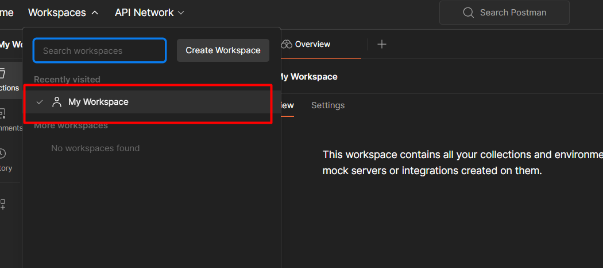
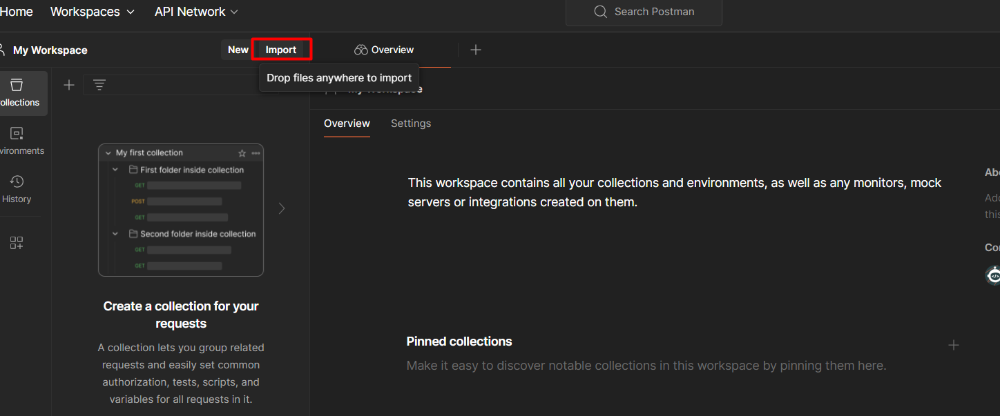

# Welcome to the API course

First we need to donwlload Postman here https://www.postman.com/downloads/

1: Press workspaces and go to my workspace

2: Click the import button

3: Cope paste this URL and postman will import the collection 

